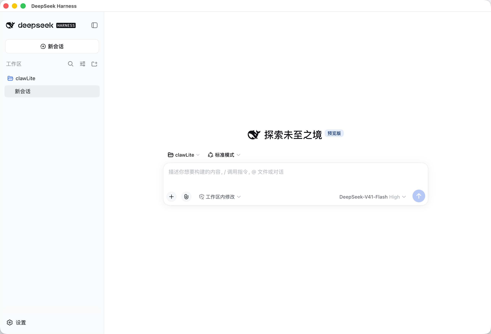
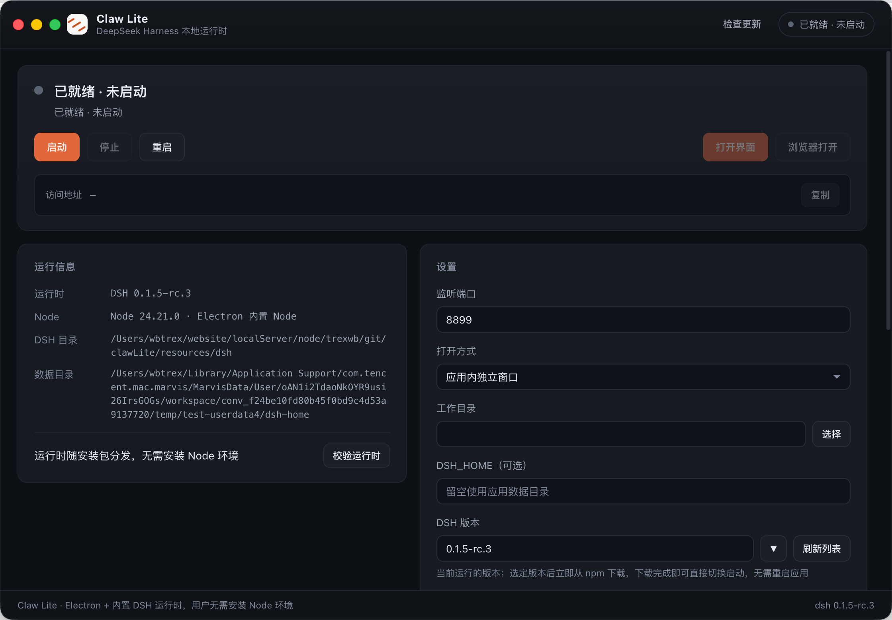

# 实践案例：用 DeepSeek Harness（dsh）开发 Claw Lite

> **一句话**：把 dsh（DeepSeek Harness）的 web 会话当作开发入口，从零写出了一个「能托管 dsh 的 Electron 桌面宿主」——Claw Lite 既是被 dsh 开发出来的项目，又是让 dsh 免装 Node 就能跑起来的载体。
>
> 本文所有结论均以仓库内实际代码、脚本与发布日志为依据，可直接对照 `electron/`、`scripts/`、`docs/version/RELEASE-v1.0.md` 复核。

---

## 1. 为什么会有这个项目

`@deepseek-ai/dsh` 的官方形态是一个 npm 包：常规用法是先装 Node 环境，再装包、跑 `dsh web`。对不写代码的用户来说，**Node 环境本身就是第一道门槛**。

Claw Lite 的做法是把门槛搬进安装包：

| 关注点 | 做法 |
|---|---|
| Node 运行时 | 不打包额外的 node 二进制，直接用 Electron 自带的 Node（v24），以 `ELECTRON_RUN_AS_NODE=1` 让应用自身充当解释器 |
| DSH 运行时 | 官方依赖树预置在 `resources/dsh/app`（含 `runtime.json` 清单），随安装包分发，用户侧不走 npm 在线安装 |
| 原生模块 | 依赖树含 `node-pty` / `sharp` 等平台相关模块，置于 asar 之外（`extraResources`），保证 `.node` 以真实文件存在 |

于是形成了一个有意思的闭环：**开发过程用 dsh 完成，开发出来的应用又用来托管 dsh**。本文记录的就是这个闭环的两端。

---

## 2. 开发侧：dsh 会话就是开发入口



上图是 dsh web 的新会话界面（预览版）：中央是「描述你想要构建的内容…」输入框，右下角可选择模型（截图中为 DeepSeek-V41-Flash High）。Claw Lite 的全部源码与构建脚本，都是在这类会话里一轮轮生成、修改、验证出来的。

实践中的三点做法：

**（1）需求 + 约束 + 验收标准一起交给会话。** 只描述「做什么」会让产出风格漂移，因此每次会话都同时给出：要改哪个模块、必须遵守哪些硬约束（如 IPC 三层对齐、CSP 不得放宽）、以及验收口径（`npm run check` 必须全绿）。

**（2）把规范固化成仓库文件，而不是每次口头重复。** 仓库根目录的 [`AGENTS.md`](../../AGENTS.md) 承载了全部强制规范——架构分层与进程模型、IPC 契约三层对齐、CSP 与安全基线、源码后缀统一、状态机枚举可达、版本号纪律、自检清单。它对人、对 dsh 会话、对本项目上运行的所有 Agent 服务都是同一份规范基线。约束写进文件后，会话产出的代码才有稳定的形状。

**（3）每一轮产出都必须过门禁。** 会话交付的代码不允许「看起来对」，必须跑 `npm run check`（静态自检）与 `npm run build`（产物验证），实测启动冒烟通过才算完成。门禁是这套开发方式的刹车片。

---

## 3. 产物侧：Claw Lite 主控制面板



上图是 Claw Lite 的主控制面板：状态胶囊显示「已就绪 · 未启动」，下方是启动 / 停止 / 重启三个动作按钮，再往下是访问地址输入框与「复制」「打开界面」按钮。这张图对应的正是 dsh 托管链路：

```
点击「启动」
  → 主进程 HarnessManager.start()
  → 以 Electron 可执行文件作纯 Node 解释器 spawn dsh web
  → HTTP 探活轮询，直至就绪
  → 从子进程 stdout 捕获 dsh web: http://127.0.0.1:<port>/?token=xxx
  → 带 token 的完整 URL 回填「访问地址」输入框
  → 「打开界面」在应用内窗口（persist:dsh-web 分区，登录态留存）或系统浏览器打开
```

界面上的每个元素都能在源码里找到出处：

| 界面元素 | 源码位置 |
|---|---|
| 状态胶囊「已就绪 · 未启动」 | `HarnessManager` 状态机 `notInstalled` / `stopped` / `starting` / `stopping` / `running` / `error`，经 `harness:state` 广播到渲染层 |
| 启动 / 停止 / 重启 | `harness:start` / `harness:stop` / `harness:restart`（preload 暴露为 `window.clawLite.start()` 等） |
| 访问地址 + 复制 | `HarnessManager._captureUrl()` 捕获带 token 的 URL；复制走 `navigator.clipboard` |
| 打开界面 | `harness:open`，`openMode` 决定应用内窗口还是系统浏览器 |

---

## 4. 开发闭环：一轮会话的完整路径

| 阶段 | 动作 | 落地产物 |
|---|---|---|
| 1. 提需求 | 在 dsh 会话中说明目标、约束与验收口径 | 会话上下文（约束以 `AGENTS.md` 为准） |
| 2. 出代码 | dsh 生成 / 修改源码 | `electron/*.ts`、`src/*.ts`、`scripts/*.ts` |
| 3. 过门禁 | `npm run check`、`npm run build`、`npm run verify:dist` | 自检全绿 + `dist/`、`dist-electron/` 产物 |
| 4. 记日志 | 按版本纪律追加发布日志 | `docs/version/RELEASE-v{主版本}.md` |
| 5. 打包分发 | `npm run dist:mac` / `dist:win` / `dist:linux` | `release/` 下安装包（CI 由 `v*` tag 触发） |
| 6. 自举验证 | 用打出来的 Claw Lite 启动 dsh，进入下一轮开发 | 见上图主控制面板 |

第 6 步是这个案例最特别的地方：**开发工具和开发产物互为验证**。Claw Lite 能否正常托管 dsh，本身就是最直接的验收。

---

## 5. 用 dsh 开发这个项目时踩到的坑

以下每一条都已在代码中固化为「禁止移除」的约束，属于本项目最有复用价值的部分：

**（1）dsh web 需要 Node 内部 binding。** spawn 时必须带 `--expose-internals`（dsh 的 `cordis-plugin-hmr` 依赖 Node 内部能力），否则 web profile 加载失败直接退出；同时需要 `ELECTRON_RUN_AS_NODE=1` 把 Electron 可执行文件当纯 Node 用，并加 `--no-open` 阻止 dsh 自行拉起浏览器。

**（2）访问 token 不能丢。** dsh 就绪时打印的 `dsh web: http://127.0.0.1:<port>/?token=xxx` 中，`token` 是 Web UI 的信任凭据，必须原样保留（缺 token 会被拒）。因此托管层的做法是「整条 URL 捕获」，而不是自己拼 `http://127.0.0.1:port`。

**（3）preload 只能是 CJS。** `sandbox: true` 下 ESM preload 必须用 `.mjs` 且要求关闭沙箱，走不通；所以产物形态是被运行时反向约束的——源码统一 `.ts`，而 `dist-electron/preload.js` 必须是 CJS（Electron 忽略 `type: module`，一律按 preload 语义加载）。

**（4）内置运行时版本不能随便追新。** dsh v0.1.7 系列依赖更新的 Node / Electron，与项目当前锁定的 Electron 版本存在兼容冲突，内置运行时维持 `0.1.5-rc.3`（由 `scripts/fetch-runtime.ts` 的 `DSH_VERSION` 决定，`resources/dsh/runtime.json` 记录实际落地版本）。升级需重跑 `npm run runtime:force`，且要等 Electron 升级迭代后再切。

**（5）约 300MB 的依赖树不能塞进 asar。** 原生模块必须解包为真实文件，否则运行期加载失败；代价是安装包体积变大（压缩后 dmg 约 150MB）。

**（6）主进程异步异常会击穿应用。** `autoUpdater` 等 EventEmitter 型模块必须挂 `error` 监听——后台下载阶段抛出的异步 error 用 `try/catch` 覆盖不到，会直接崩掉主进程。

---

## 6. 工程门禁：让「AI 产出」可控

会话式开发的产出必须被机器反复检查，Claw Lite 的门禁分三层：

**第一层：静态自检 `npm run check`**（`scripts/check.ts`）

- JSON 合法性、关键文件存在性
- 源码后缀门禁（`electron/`、`scripts/`、`src/` 无残留 `.cjs` / `.mjs` / `.js`）+ `tsc --noEmit` 类型检查
- **IPC 契约三层对齐**：渲染层 `api.*` → preload 暴露方法 → 主进程 `ipcMain.handle` 通道 / 广播事件
- 内置 DSH 运行时完整性、无残留 Tauri 依赖
- **状态枚举双向可达**：`setState` 取值 ↔ 渲染层 `STATE_LABEL`，多出来的即死枚举
- **日志着色类名 ↔ CSS 交叉**：同时拦死样式与死类名
- **端口范围三方一致**：`index.html` ↔ `src/shared/constants.ts` ↔ `harness.ts`
- **安全与无障碍基线**：`webPreferences`、CSP 脚本侧未放宽、播报区唯一
- **产物模块形态**：主进程产物必须 ESM、preload 产物必须 CJS

**第二层：产物校验 `npm run verify:dist`**（`scripts/verify-dist.ts`，需先 `npm run build:web`）

断言 `dist/index.html` 的资源引用为相对路径（`base: './'` 未被动过）、品牌图标资产真实产出并被引用——静态自检看不到构建产物的形态。

**第三层：CI 流水线**（`.github/workflows/release.yml`）

推送 `v*` tag（或手动触发）后，在 macOS / Windows runner 上执行 `npm ci → npm run runtime → npm run check → npm run build:web → npm run verify:dist → electron-builder`，产物汇总后由 `publish` job 创建 GitHub Release。**能过 CI 的产出才算完成**，本地「我这儿能跑」不作数。

---

## 7. 版本纪律：文档与代码同步的约定

会话式开发容易「改完就忘」，因此版本纪律被写成硬规则（`AGENTS.md` §0）：

- **版本号单一来源**：`package.json` 的 `version`；`electron-builder` 的产物名、`app.getVersion()`、`app:info` 全部读这一处。
- **发布前（v1.0.0 基线阶段）**：末位 +1 仅限「不同类、不同根因的新功能 / 新修复」且用户明确允许；同一问题多轮往返、同日同模块追加修复、**仅文档更新**、纯 CSS / 文案打磨一律不推进版本号。本次新增的案例文档与 wiki 文件集即按此口径维持 v1.0.0，仅在发布日志追加分节说明。
- **正式发布后（v1.0.1 起）**：按语义化版本（SemVer）正常迭代——破坏性变更推主版本、向后兼容新功能推次版本、向后兼容修复与文档 / 样式等非功能性改动推修订号。
- **每次迭代都要写日志**：在 `docs/version/RELEASE-v{主版本}.md` 顶部追加分节，标注日期与版本号（用户明确要求不改版本号时注明「不推进版本号」）；历史日志只增不改。
- **内置 DSH 运行时版本是独立维度**：由 `scripts/fetch-runtime.ts` 的 `DSH_VERSION` 决定，与应用版本互不影响；内置 DSH 依赖树自身的 `package.json` 的 `version` 也不属于应用版本，不随应用版本改动。

---

## 8. 相关文件索引

| 文件 / 目录 | 作用 |
|---|---|
| [`README.md`](../../README.md) | 项目介绍、快速开始、打包与配置 |
| [`AGENTS.md`](../../AGENTS.md) | 强制规范（架构、IPC、CSP、编码、版本纪律、自检清单） |
| [`docs/version/RELEASE-v1.0.md`](../version/RELEASE-v1.0.md) | v1.0 版本迭代日志 |
| [`docs/case/`](.) | 实践案例文档（本目录） |
| [`docs/wiki/`](../wiki/) | 可直接发布的 GitHub wiki markdown 文件集 |
| [`docs/images/`](../images/) | 案例截图素材（`0.png` 主控制面板 / `1.png` dsh 会话） |

